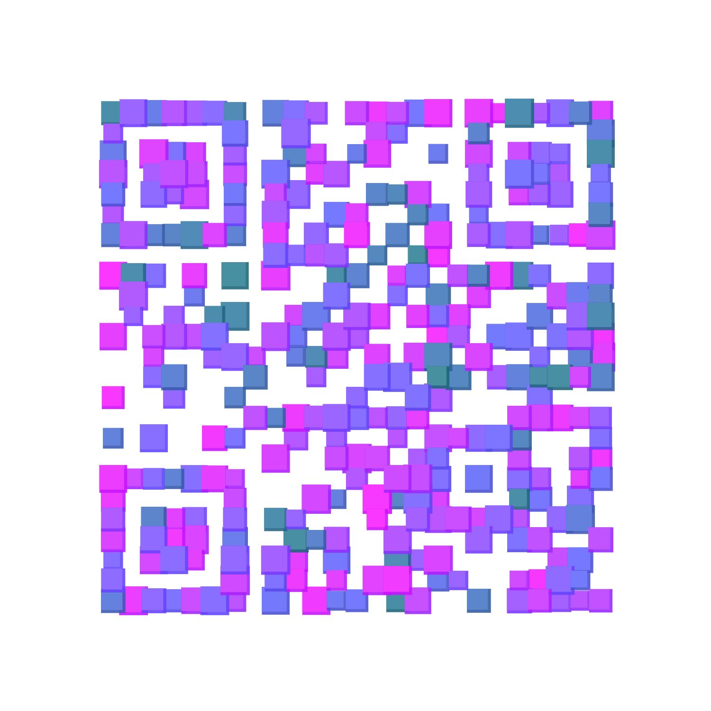

# vue-music-next
基于 ```Vue2 + Vue-Cli3 + vuex + vue-router + axios ``` 全家桶练习的云音乐

项目演示地址 :point_right: ：[vue-music-next](http://47.103.222.160/)

或者扫码查看:



- 推荐使用手机浏览(小米自带浏览器有兼容问题)，电脑调试模式下如果无法滑动，可以刷新一下页面。

### 后端接口
[NeteaseCloudMusicApi](https://binaryify.github.io/NeteaseCloudMusicApi)

### 功能
 - [ ] 歌单详情
 - [ ] 歌手详情
 - [ ] 排行榜
 - [ ] 播放器、歌词
 - [ ] 搜索建议、历史
 - [ ] 播放记录
 - [ ] 我的收藏
 - [ ] 播放列表

### 技术栈
 - ***Vue***  :Vue-cli3 Create
 - ***Vant***  :swipe/Dialog/loading/lazyload, 框架用着舒服
- ***postcss-pxtorem***  :不必每次都要写px2rem了
- ***better-scroll***  :遇到很多坑，但解决后很开心
- ***lyric-parser***  :歌词解析
- ***ES6***
- ***Sass***

## 效果预览
部分gif比较大，可能需要一些时间
<figure class="third">
    
    
    
</figure>
<figure class="third">
    
    
    
</figure>
<figure class="half">
    
    
</figure>

### 感谢
- [Binaryify](https://github.com/Binaryify) 的 [NeteaseCloudMusicApi](https://binaryify.github.io/NeteaseCloudMusicApi/#/?id=neteasecloudmusicapi)
网易云音乐接口
- 感谢 [ustbhuangyi](https://github.com/ustbhuangyi) 老师

- 部分样式参考了 [caijinyc]() 的 [vue-music-webapp](https://github.com/caijinyc/vue-music-webapp) 项目

## 收获
一个项目完整的开发过程，对 Vue 全家桶的掌握更加熟练。其实功能是一点点的完善的，不是一蹴而就的。遇到问题不能放弃，一步步的调试，一步步观察，通过 debugger 发现问题。而那些看起来流畅的动画需要分步实现。多试错以后便不会犯同样的错。

## 最后

如果您觉得我的项目还不错的话 :blush:，就给个 star :star: 鼓励一下吧~

## 开启服务
代码克隆到本地后需要再 clone  [NeteaseCloudMusicApi](https://binaryify.github.io/NeteaseCloudMusicApi/#/?id=neteasecloudmusicapi)  开启一个接口获取数据。

```
npm install

npm run serve
```
如果遇到 npm 安装问题，请仔细查看报错信息即可解决。

如果放到服务器上，请在服务器上开启一个音乐接口并把 ```.env.production``` 文件里面的接口改成自己的地址。

### 编译
```
npm run build
```


